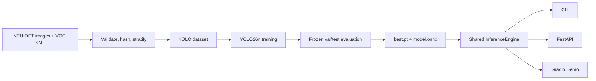

# Industrial Defect Inspection

[English](README.md) | [简体中文](docs/README_zh-CN.md)

[](https://github.com/5dawn/industrial-defect-inspection/actions/workflows/ci.yml)
[](LICENSE)
[](https://www.python.org/)

A reproducible, portfolio-ready pipeline for detecting six steel-surface defect
types with YOLO26n, exporting to ONNX, and serving predictions through FastAPI
and Gradio.

> Research and portfolio demo. It is not validated for production quality
> control or safety-critical decisions.

## Status and results

The engineering pipeline is complete. Dataset files, trained weights, and
measured results are deliberately not committed. Replace the pending values
only after a frozen test-set evaluation.

| Model | Dataset | mAP50 | mAP50-95 | CPU p50 | Artifact |
|---|---|---:|---:|---:|---|
| YOLO26n | NEU-DET test | pending | pending | pending | GitHub Release after training |

## Architecture



## Features

- Strict Pascal VOC validation: missing pairs, unknown classes, invalid boxes,
  image/XML size drift, and duplicate image content.
- Seeded, label-stratified 70/15/15 train/validation/test split.
- Configuration-driven YOLO26n training with a CPU smoke profile.
- Per-class metrics, confusion plots, FP/FN galleries, and p50/p95 latency.
- PyTorch and ONNX inference through the same public result schema.
- Single-image and directory CLI inference with annotated images and JSON.
- FastAPI endpoints plus a queued, local Gradio UI.
- Unit and integration tests that use synthetic data and never download weights.

## Setup on Windows

Python 3.11 is the project target. Create and activate a virtual environment:

```powershell
python -m venv .venv
.venv\Scripts\Activate.ps1
python -m pip install --upgrade pip
```

Install PyTorch first with the command generated by the
[official PyTorch selector](https://pytorch.org/get-started/locally/). Select
Windows, Pip, Python, and either CPU or the CUDA version supported by the local
driver. Installing PyTorch first prevents the project installer from choosing a
wheel that does not match the machine.

Install the project and development checks through the standard requirements
entry point:

```powershell
pip install -r requirements.txt
```

`requirements.txt` delegates to `pyproject.toml`, which remains the dependency
source of truth. `requirements-lock-cu130.txt` records one verified CUDA 13.0
environment and is not the general installation command. Check the selected
device with:

```powershell
python -c "import torch; print(torch.__version__, torch.cuda.is_available())"
```

## Prepare NEU-DET

The dataset is not redistributed. Follow [data/README.md](data/README.md), put
the images and XML files under `data/raw/neu_det`, then run:

```powershell
idi-prepare --config configs/data/neu_det.yaml
```

The command creates `data/processed/neu_det/dataset.yaml`, manifests, YOLO
labels, a metadata file, and annotation previews. It refuses to replace an
existing processed dataset unless `--overwrite` is explicitly supplied.

## MVP workflow: train, validate, and predict

Run the short CPU smoke profile before a full experiment. It trains for only
two epochs and proves that the pipeline runs; its metrics are not formal model
results and must not replace the pending table above.

```powershell
idi-train --config configs/train/smoke.yaml
```

After a real training run, set `model` in `configs/eval/default.yaml` to the
checkpoint to validate, then run:

```powershell
idi-evaluate --config configs/eval/default.yaml
```

The evaluation config owns the model, dataset, output directory, split,
threshold, image size, error-gallery size, and benchmark count. CLI arguments
such as `--model`, `--split`, and `--output` remain available as explicit
overrides.

For a single-image prediction, set `model` in `configs/infer/default.yaml` or
pass `--model`, then run:

```powershell
idi-predict --config configs/infer/default.yaml --source path\to\image.jpg
```

The command writes an annotated JPEG and a structured JSON result to the
configured `output_dir`. It fails before model loading when the model or input
image does not exist.

## Full training and evaluation

The full configuration is intentionally separate from the MVP smoke check:

```powershell
idi-train --config configs/train/yolo26n.yaml
```

Tune only on validation data. Run the test split after freezing the model,
threshold, and image size:

```powershell
idi-evaluate --config configs/eval/default.yaml --split val
idi-evaluate --config configs/eval/default.yaml --split test --output reports/metrics/test
```

Each evaluation writes machine-readable metrics, Ultralytics plots, up to 20
false-positive and false-negative examples, and a 100-image latency benchmark.

## Export and infer

```powershell
idi-export --model artifacts/runs/neu-det-yolo26n-v1/weights/best.pt --output artifacts/models/neu-det-yolo26n-v1/model.onnx
idi-predict --config configs/infer/default.yaml --model artifacts/runs/neu-det-yolo26n-v1/weights/best.pt --source path/to/image-or-directory
```

Both `.pt` and `.onnx` models are accepted by `InferenceEngine`. Before a
release, compare both backends on at least 20 test images and record the result
in the model card.

## Web demo and API

The Gradio demo and FastAPI service use the same `InferenceEngine` as the CLI.
Point the inference configuration at a trained checkpoint or override it at startup. For an
explicit CPU launch using the local smoke checkpoint:

```powershell
idi-web --config configs/infer/default.yaml `
  --model artifacts/runs/smoke/weights/best.pt `
  --device cpu
```

Open <http://127.0.0.1:7860/demo/>. API documentation is available at
<http://127.0.0.1:7860/docs>. Upload one JPEG, PNG, or WebP image, adjust the confidence
threshold, and select **Run inspection**. The page displays the annotated image, defect class,
confidence, bounding-box coordinates, preprocessing/inference/postprocessing time, device, and
model version. Annotated images and structured JSON are saved under the configured `output_dir`.

The smoke checkpoint only verifies the workflow and must not be presented as a formal result. Use
a frozen production candidate for portfolio metrics. If the configured model is missing, the
server still starts in degraded mode: the page shows the expected path and `--model` guidance,
`GET /health` reports `degraded`, and prediction requests return a clear unavailable response.

| Endpoint | Purpose |
|---|---|
| `GET /health` | Service, device, and model load state |
| `GET /metadata` | Classes, threshold, model version, and disclaimer |
| `POST /predict` | JPEG/PNG/WebP multipart upload; returns structured detections |

Uploads are limited to 10 MB. Images larger than 4096 pixels on either side are
resized while their original dimensions are retained in the response. Empty, corrupt, disguised,
or unsupported files are rejected before model inference.

## Repository layout

```text
configs/        Reproducible data, training, and inference settings
data/           Download instructions and ignored raw/processed locations
src/            Installable package, CLI tools, API, and demo
tests/          Synthetic unit and integration tests
notebooks/      EDA and error-analysis starting points
reports/        Dataset card, model card, metrics, and figures
artifacts/      Ignored checkpoints, exports, runs, and demo outputs
```

## Reproducibility and release checklist

1. Commit the exact configuration before the full run.
2. Keep seed 42 and deterministic mode enabled; record the environment snapshot.
3. Select checkpoint and confidence on validation only.
4. Run the test evaluation once after choices are frozen.
5. Replace the pending README metrics with the generated report.
6. Complete `reports/model_card.md` and publish `.pt`, `.onnx`, metrics, and
   checksums in a GitHub Release—never the dataset.

## Data and software licenses

NEU-DET and GC10-DET do not present a clear standard dataset license on their
download pages. This repository does not redistribute either dataset. See the
[dataset card](reports/dataset_card.md) before publishing derivatives.

The source code is AGPL-3.0-only because it integrates Ultralytics software and
models under its open-source license. Commercial or closed-source use may
require different dependencies or an Ultralytics enterprise license.
