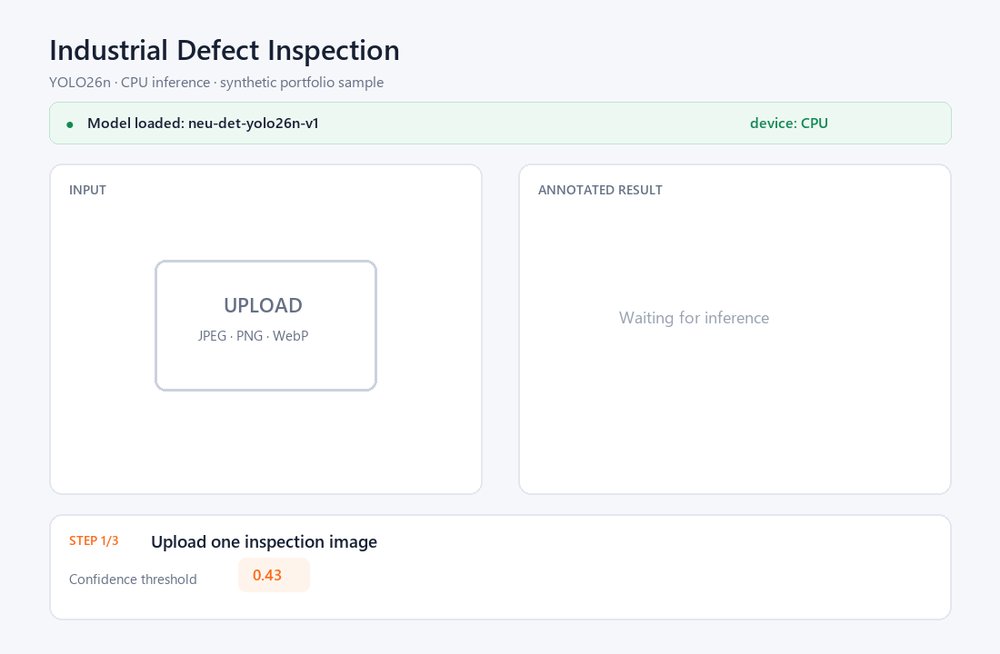
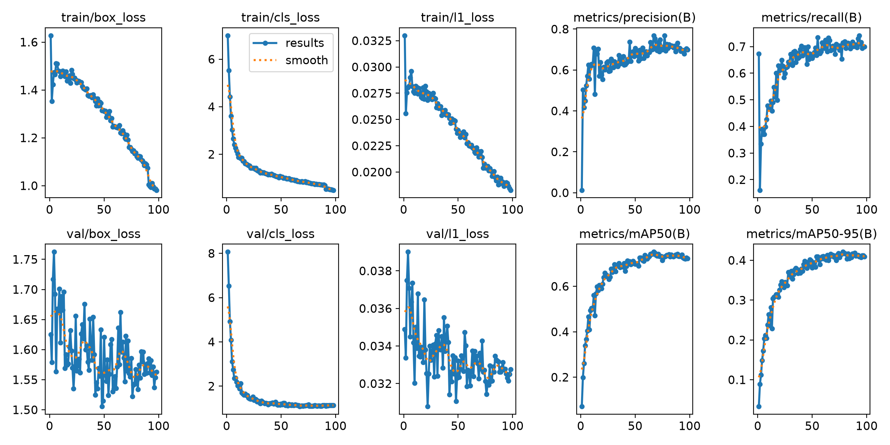
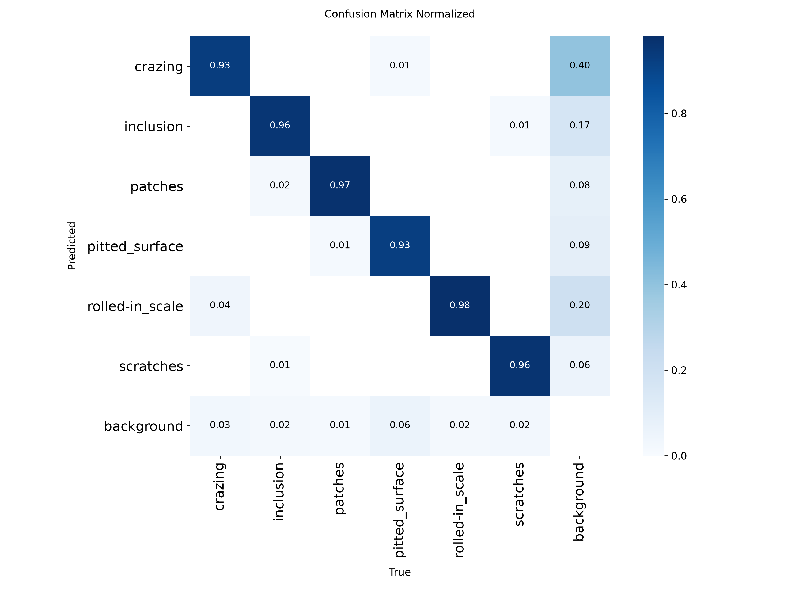
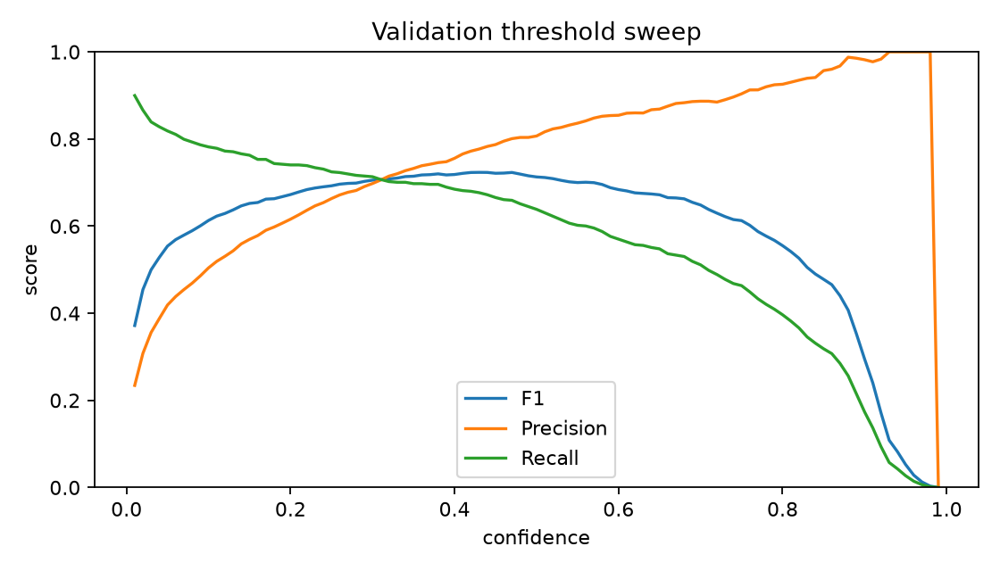
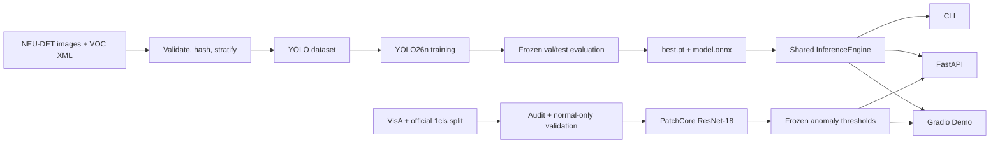

# Industrial Defect Inspection

[English](README.md) | [简体中文](docs/README_zh-CN.md)

[](https://github.com/5dawn/industrial-defect-inspection/actions/workflows/ci.yml)
[](LICENSE)
[](https://www.python.org/)

A reproducible, portfolio-ready pipeline for supervised steel-surface defect
detection with YOLO26n and one-class anomaly localization with PatchCore. Both
tasks share configuration, upload validation, FastAPI, and a two-mode Gradio demo.

> Research and portfolio demo. It is not validated for production quality
> control or safety-critical decisions.



The animation uses an AI-generated synthetic steel image rather than
redistributing NEU-DET pixels. Its boxes, confidence values, and displayed CPU
timing come from an actual local inference with the formal checkpoint; the
controlled benchmark results are reported separately below.

The public `v0.1.1` release is source-only: it contains aggregate reports and
checksums, but no NEU-DET pixels or dataset-derived `.pt`/`.onnx` weights. To run
the Demo, train the checkpoint locally after reviewing the upstream dataset
terms.

## Status and results

The formal run completed on 2026-08-11. The checkpoint was selected on the
validation split, the operating confidence (`0.43`) was selected by validation
micro-F1, and the frozen test split was then evaluated once. Precision, Recall,
and F1 below use IoU 0.5 at that frozen threshold; mAP uses the full PR curve
collected from confidence `0.001`.

The registered v0.2 ablation did not replace this baseline. The best candidate
(`weak-640`) reached validation mAP50-95 `0.40286 ± 0.00458` over seeds
42/43/44, versus v1's `0.42095`; its two weak classes also did not improve.
Accordingly, no candidate test evaluation or v2 export was run. See the
[validation-only negative result](reports/metrics/published/experiments/v2/README.md).

| Model | Split | Precision | Recall | F1 | mAP50 | mAP50-95 |
|---|---|---:|---:|---:|---:|---:|
| YOLO26n | validation | 0.777 | 0.677 | 0.723 | 0.733 | 0.421 |
| YOLO26n | frozen test | **0.775** | **0.701** | **0.736** | **0.776** | **0.441** |

| Backend | Device | p50 | p95 | Throughput | Peak resource |
|---|---|---:|---:|---:|---:|
| PyTorch FP32 | Intel i5-12600KF CPU | 43.38 ms | 46.82 ms | 23.00 FPS | 650.24 MB process RSS |
| ONNX Runtime FP32 | Intel i5-12600KF CPU | **22.98 ms** | **26.19 ms** | **42.60 FPS** | 763.09 MB process RSS |
| PyTorch FP32 | RTX 5060 Ti | 13.26 ms | 15.76 ms | 74.48 FPS | 65.14 MB allocated VRAM |

Latency is batch=1 end-to-end wall time on 100 test images after 10 warmups.
The process RSS includes Python and loaded runtime libraries, not only model
weights. The PT checkpoint is 5.40 MB with 2,376,006 parameters; the ONNX model
is 9.76 MB. On 20 test images, all 24 PT detections matched ONNX detections,
with mean box IoU 0.999999 and maximum confidence difference 0.000015.



Published, dataset-pixel-free evidence is available in the
[experiment summary](reports/metrics/published/experiment/experiment_summary.json),
[per-class CSV](reports/metrics/published/experiment/test_per_class.csv), and
[figures](reports/figures/published/experiment/).

### Per-class frozen test results

| Class | Precision | Recall | F1 | AP50 | AP50-95 |
|---|---:|---:|---:|---:|---:|
| crazing | 0.539 | 0.410 | 0.466 | 0.465 | 0.179 |
| inclusion | 0.781 | 0.742 | 0.761 | 0.859 | 0.451 |
| patches | 0.872 | 0.918 | 0.895 | 0.951 | 0.618 |
| pitted_surface | 0.842 | 0.706 | 0.768 | 0.833 | 0.534 |
| rolled-in_scale | 0.679 | 0.534 | 0.598 | 0.665 | 0.308 |
| scratches | 0.863 | 0.821 | 0.841 | 0.882 | 0.557 |

At the frozen operating point, test error analysis counted 133 false-positive
and 195 false-negative boxes. `crazing` is the clearest weakness (Recall 0.410,
AP50-95 0.179), followed by `rolled-in_scale` (Recall 0.534). Raw error-gallery
images remain local because the upstream dataset does not state a standard
redistribution license.

The validation-only diagnostic report found 84 localization failures, 31
background false positives, and 7 duplicate predictions at the selected
operating point. Recall was lowest in the third ground-truth area quartile
(0.586), showing that size alone does not explain the weak classes. See the
[aggregate analysis](reports/metrics/published/analysis/validation/README.md);
it contains hashes and statistics, not dataset pixels or workstation paths.





## Architecture



## Features

- Strict Pascal VOC validation: missing pairs, unknown classes, invalid boxes,
  image/XML size drift, and duplicate image content.
- Seeded, label-stratified 70/15/15 train/validation/test split.
- Configuration-driven YOLO26n training with a CPU smoke profile.
- Per-class metrics, confusion plots, FP/FN galleries, and p50/p95 latency.
- PyTorch and ONNX inference through the same public result schema.
- Single-image and directory CLI inference with annotated images and JSON.
- FastAPI endpoints plus a queued, local Gradio UI.
- VisA `candle`, `capsules`, and `pcb1` preparation with an untouched official
  test split and normal-only threshold calibration.
- PatchCore heatmaps, masks, overlays, image/pixel metrics, and CPU resource reports.
- Unit and integration tests that use synthetic data and never download weights.

## Setup on Windows

Python 3.11 is the project target. Create and activate a virtual environment:

```powershell
python -m venv .venv
.venv\Scripts\Activate.ps1
python -m pip install --upgrade pip
```

Install PyTorch first with the command generated by the
[official PyTorch selector](https://pytorch.org/get-started/locally/). Select
Windows, Pip, Python, and either CPU or the CUDA version supported by the local
driver. Installing PyTorch first prevents the project installer from choosing a
wheel that does not match the machine.

Install the project and development checks through the standard requirements
entry point:

```powershell
pip install -r requirements.txt
```

Install the optional PatchCore/VisA dependencies only when using anomaly localization:

```powershell
pip install -e ".[anomaly,dev]"
```

`requirements.txt` delegates to `pyproject.toml`, which remains the dependency
source of truth. `requirements-lock-cu130.txt` records one verified CUDA 13.0
environment and is not the general installation command. Check the selected
device with:

```powershell
python -c "import torch; print(torch.__version__, torch.cuda.is_available())"
```

## Prepare NEU-DET

The dataset is not redistributed. Follow [data/README.md](data/README.md), put
the images and XML files under `data/raw/neu_det`, then run:

```powershell
idi-prepare --config configs/data/neu_det.yaml
```

The command creates `data/processed/neu_det/dataset.yaml`, manifests, YOLO
labels, a metadata file, and annotation previews. It refuses to replace an
existing processed dataset unless `--overwrite` is explicitly supplied.

## VisA anomaly localization (v0.3)

Download VisA and the official `split_csv/1cls.csv` from the
[Amazon Science repository](https://github.com/amazon-science/spot-diff), then
arrange them as documented in [data/README.md](data/README.md):

```text
data/raw/visa/
├── candle/
├── capsules/
├── pcb1/
└── split_csv/1cls.csv
```

Install the optional dependencies, prepare the three categories, and fit one
PatchCore memory bank per category:

```powershell
pip install -e ".[anomaly,dev]"
idi-prepare-visa --config configs/data/visa.yaml
idi-fit-anomaly --config configs/anomaly/patchcore_resnet18.yaml
```

Preparation writes aspect-ratio-preserving 256×256 images and masks. It keeps
the official test rows frozen and reserves 20% of official normal training
images for calibration. Image and pixel thresholds are the 99% and 99.5%
quantiles of normal validation scores; anomalous test masks are never used to
choose them.

```powershell
idi-evaluate-anomaly --config configs/anomaly/eval.yaml
idi-predict-anomaly --config configs/anomaly/infer.yaml `
  --category candle --source path\to\image.jpg
```

Frozen evaluation reports image AUROC, pixel AUROC, Dice, IoU, normal-test FPR,
CPU p50/p95 latency, FPS, and peak process RAM. This repository does not contain
VisA data or trained PatchCore checkpoints, so anomaly metrics remain pending
until those commands complete on the real dataset.

After all three checkpoints and metadata files exist, build a dataset-pixel-free
release bundle with attribution and SHA-256 checksums:

```powershell
idi-package-anomaly-release --version v0.3.0 `
  --config configs/anomaly/infer.yaml --output artifacts/releases/v0.3.0
```

## MVP workflow: train, validate, and predict

Run the short CPU smoke profile before a full experiment. It trains for only
two epochs and proves that the pipeline runs; its metrics are not formal model
results and must not replace the formal table above.

```powershell
idi-train --config configs/train/smoke.yaml
```

After a real training run, select the operating threshold on validation only:

```powershell
idi-evaluate --config configs/eval/default.yaml
```

The evaluation config separates `metric_confidence: 0.001` for mAP collection
from the selected operating threshold used for P/R/F1 and error analysis. It
also owns the dataset, output directory, split, IoU, image size, gallery size,
and benchmark count. CLI arguments remain explicit overrides.

For a single-image prediction, set `model` in `configs/infer/default.yaml` or
pass `--model`, then run:

```powershell
idi-predict --config configs/infer/default.yaml --source path\to\image.jpg
```

The command writes an annotated JPEG and a structured JSON result to the
configured `output_dir`. It fails before model loading when the model or input
image does not exist.

## Full training and evaluation

The full configuration is intentionally separate from the MVP smoke check:

```powershell
idi-train --config configs/train/yolo26n.yaml
```

Tune only on validation data. Run the test split after freezing the model,
threshold, and image size:

```powershell
idi-evaluate --config configs/eval/default.yaml --split val
idi-evaluate --config configs/eval/test.yaml
```

The committed test configuration contains the validation-selected confidence
`0.43`. Each evaluation writes overall and per-class P/R/F1/AP, Ultralytics
plots, a machine-readable FP/FN manifest, up to 20 local error examples, an
environment manifest, logs, and a 100-image latency/resource benchmark.

Build the aggregate validation-only error analysis without copying source
images into the report:

```powershell
idi-analyze-errors `
  --evaluation artifacts/evaluations/validation/evaluation.json `
  --errors artifacts/evaluations/validation/error_samples/errors.csv `
  --dataset data/processed/neu_det/dataset.yaml `
  --output artifacts/analysis/validation
```

The report separates duplicate predictions, class confusion, localization
failures, and background false positives; it also records confidence/matching
IoU distributions and recall by ground-truth box-area quartile.

### Registered v0.2 ablations

The experiment YAML files under `configs/train/experiments/v2/` encode the
fixed matrix. All three candidate configurations are screened with seed 42;
only the top two validation mAP50-95 configurations continue to seeds 43 and
44. `idi-compare-experiments` refuses a final report unless each candidate has
all three seeds. Promotion requires either +0.010 overall validation mAP50-95,
or +0.025 mean AP50-95 on `crazing` and `rolled-in_scale` with no more than a
0.005 overall drop. Frozen test metrics never participate in selection.

## Export and infer

```powershell
idi-export --model artifacts/runs/neu-det-yolo26n-v1/weights/best.pt --output artifacts/models/neu-det-yolo26n-v1/model.onnx
idi-predict --config configs/infer/default.yaml --model artifacts/runs/neu-det-yolo26n-v1/weights/best.pt --source path/to/image-or-directory
idi-benchmark --pt-model artifacts/runs/neu-det-yolo26n-v1/weights/best.pt `
  --onnx-model artifacts/models/neu-det-yolo26n-v1/model.onnx `
  --confidence 0.43
```

Both `.pt` and `.onnx` models are accepted by `InferenceEngine`. Before a
release, compare both backends on at least 20 test images and record the result
in the model card.

## Web demo and API

The Gradio demo and FastAPI service use the same `InferenceEngine` as the CLI.
Point the inference configuration at a trained checkpoint or override it at startup. For an
explicit CPU launch using the formal local checkpoint:

```powershell
idi-web --config configs/infer/default.yaml `
  --model artifacts/runs/neu-det-yolo26n-v1/weights/best.pt `
  --device cpu
```

Open <http://127.0.0.1:7860/demo/>. API documentation is available at
<http://127.0.0.1:7860/docs>. Upload one JPEG, PNG, or WebP image, adjust the confidence
threshold, and select **Run detection**. The page displays the annotated image, defect class,
confidence, bounding-box coordinates, preprocessing/inference/postprocessing time, device, and
model version. Annotated images and structured JSON are saved under the configured `output_dir`.
The repository includes an explicitly synthetic
[sample image](assets/demo/synthetic_steel_sample.jpg) for a license-safe first run.

The default confidence is the validation-selected `0.43`. If the configured model is missing, the
server still starts in degraded mode: the page shows the expected path and `--model` guidance,
`GET /health` reports `degraded`, and prediction requests return a clear unavailable response.

When `configs/anomaly/infer.yaml` is present, the page also includes an
**Anomaly localization** tab with a category selector, heatmap, binary mask,
overlay, anomaly score, frozen threshold, anomalous area, and timing. Missing
category checkpoints produce a repair command without preventing the service
from starting. Pass `--no-anomaly` for a detection-only launch.

| Endpoint | Purpose |
|---|---|
| `GET /health` | Service, device, and model load state |
| `GET /metadata` | Classes, threshold, model version, and disclaimer |
| `POST /predict` | JPEG/PNG/WebP multipart upload; returns structured detections |
| `GET /metadata/anomaly` | Supported/available VisA categories and model metadata |
| `POST /predict/anomaly?category=candle` | Multipart upload; returns `AnomalyResult` |

Uploads are limited to 10 MB. Images larger than 4096 pixels on either side are
resized while their original dimensions are retained in the response. Empty, corrupt, disguised,
or unsupported files are rejected before model inference.

## Repository layout

```text
configs/        Reproducible data, training, and inference settings
data/           Download instructions and ignored raw/processed locations
src/            Installable package, CLI tools, API, and demo
tests/          Synthetic unit and integration tests
notebooks/      EDA and error-analysis starting points
reports/        Dataset card, model card, metrics, and figures
artifacts/      Ignored checkpoints, exports, runs, and demo outputs
```

## Reproducibility and release checklist

1. Keep seed 42 and deterministic mode enabled; record the code diff hash and environment.
2. Select checkpoint and confidence on validation only.
3. Run the test evaluation once after choices are frozen.
4. Generate the public aggregate report with `idi-publish-report`; do not copy raw images.
5. While the NEU-DET license remains unclear, publish only aggregate metrics,
   environment details, and checksums—never dataset pixels or derived weights.

Create the allowlisted, source-only evidence bundle with:

```powershell
idi-package-release --version v0.1.1 --output artifacts/releases/v0.1.1
```

The packager rejects model files, images, XML annotations, absolute local
paths, and any input outside its fixed report allowlist.

## Data and software licenses

NEU-DET and GC10-DET do not present a clear standard dataset license on their
download pages. This repository does not redistribute either dataset. See the
[dataset card](reports/dataset_card.md) before publishing derivatives.

The source code is AGPL-3.0-only because it integrates Ultralytics software and
models under its open-source license. Commercial or closed-source use may
require different dependencies or an Ultralytics enterprise license.
