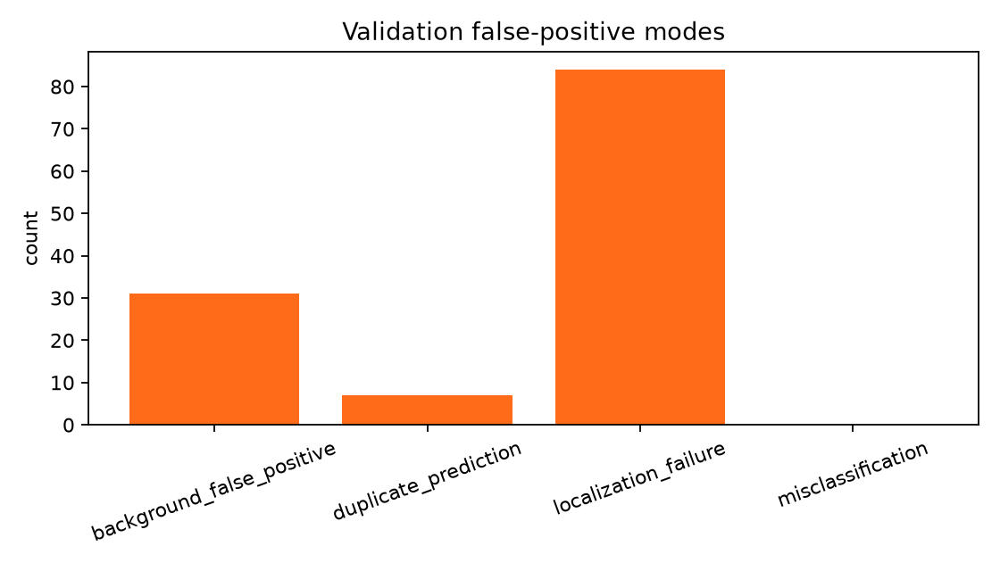
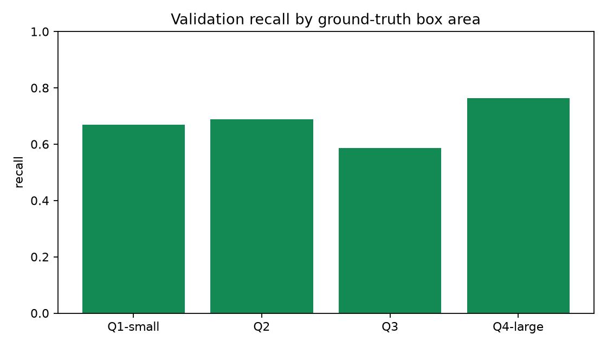

# Validation error analysis (v1)

This report uses only the validation split and the validation-selected
operating confidence of 0.43 at IoU 0.5. It was not produced by comparing test
results. The machine-readable source is [`analysis.json`](analysis.json).

## Operating-point summary

| TP | FP | FN | Precision | Recall | F1 |
|---:|---:|---:|---:|---:|---:|
| 425 | 122 | 203 | 0.777 | 0.677 | 0.723 |

Among the 122 false-positive boxes, 84 were localization failures, 31 were
background false positives, and 7 were duplicate predictions. No wrong-class
box overlapped a ground-truth box by at least 0.5 IoU at this operating point.
Localization failures use same-class IoU in the interval `[0.1, 0.5)`;
duplicate predictions have same-class IoU of at least 0.5 after another box
already claimed the target.

## Recall by normalized ground-truth area

| Area quartile | GT | TP | FN | Recall |
|---|---:|---:|---:|---:|
| Q1-small | 157 | 105 | 52 | 0.669 |
| Q2 | 157 | 108 | 49 | 0.688 |
| Q3 | 157 | 92 | 65 | 0.586 |
| Q4-large | 157 | 120 | 37 | 0.764 |

`crazing` remains the weakest class (AP50-95 0.128, recall 0.364), followed by
`rolled-in_scale` (AP50-95 0.241, recall 0.526). The non-monotonic area result
shows that these errors cannot be explained by small boxes alone; texture
ambiguity and localization are the next controlled experiment targets.

The report contains only aggregate statistics, normalized box areas, and
hashes. It does not contain NEU-DET pixels, image names, annotations, or local
workstation paths.
